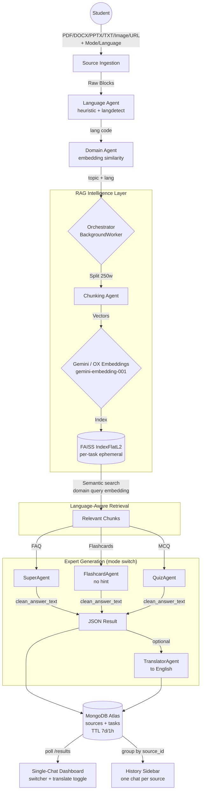
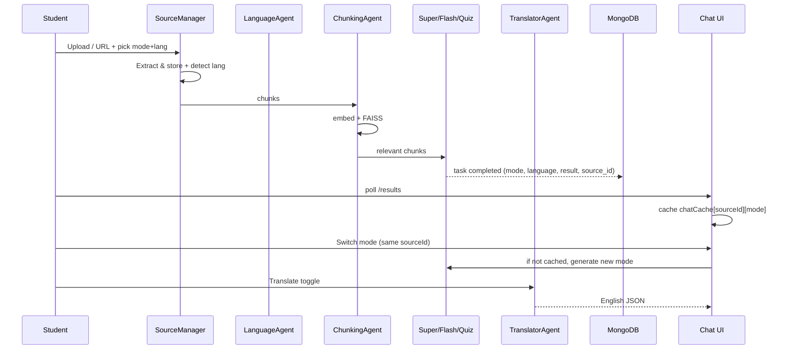

# 🏛️ Aquila Learn System Architecture

> **AquilaFAQ → Smart Student Learning System (v4.0)** — single-chat, multilingual, multi-modal.

## 🔄 High-Level Data Flow

## 🛠️ The 6-Phase Learning Pipeline

### Phase 1: Multi-Modal Ingestion & Language
`SourceManagerAgent` delegates to `DocumentAgent` (pdfplumber), `FileAgent` (docx/pptx/txt), `ImageAgent` (Pillow + Vision OCR via OpenRouter/Gemini), `WebAgent` (requests+bs4, SSRF guard). `LanguageAgent` detects script (`\u0900` Devanagari → hi, `\u0B80` Tamil → ta, etc.) + `langdetect` → `language` field persisted.

### Phase 2: Vectorization (Memory)
`ChunkingAgent.chunk()` → 250-word overlapping blocks → `embed()` batches 100 (OX if `OX_EMBED_MODEL` else Gemini, 50-concurrency) → `FAISSStore.add()` auto-init dim. Per-task `FAISSStore` avoids cross-user leakage.

### Phase 3: Domain & Retrieval
`DomainAgent.detect_topics()` embeds `sample_text[:3000]` and cosine-sim against pre-embedded categories (Technical/Medical/... General, threshold 0.35). `DomainAgent.generate_title()` (LLM) in parallel with embeddings. Retrieval: embed `target_domain` and `FAISS.search(top_k = num_items+2)`.

### Phase 4: Expert Synthesis (Mode-Aware)
`BackgroundWorker._async_learn_task(task_id, source_data, num_items, target_domain, target_language, mode)`:
- `mode=faq` → `SuperAgent.generate_batch(chunks, n, domain, lang)` — student-friendly, forbids `Chunk` refs, `clean_answer_text` post-process
- `mode=flashcards` → `FlashcardAgent.generate(...)` — `{front,back,difficulty,source_reference}` no hint
- `mode=quiz` → `QuizAgent.generate(...)` — `{question, options[4], correct_index, explanation, difficulty}`
All prompts enforce `Language: {lang_name}` and `CRITICAL: JSON only`.

### Phase 5: Translation (On-Demand)
`TranslatorAgent.translate_task(task, target="en")` builds mode-specific JSON payload and calls `LLMClient.chat_json` to translate `question/answer` or `front/back` or `question/options/explanation` while keeping `correct_index`.

### Phase 6: State & Single-Chat

- **Task Manager**: `create_task(user_id, source_name, mode, language, source_id)`, `update(status, result, trace)`, TTL indexes (`expires_at`), `mode`/`language`/`source_id` indexes; `get_user_tasks` sorted desc.
- **MongoDB**: `sources` and `tasks` collections, 7-day (auth) / 1-hour (anon) TTL, user+source indexes.
- **Background Worker**: `Thread` + `asyncio.run(_async_learn_task)` to keep API responsive; `RateLimiter` 60 rpm.

## 🤖 Agent Workforce (v4.0)

### 1. Source & Extraction
- **SourceManagerAgent** (`app/agents/source_manager.py`): TTL, `ingest_document/file/image/web`, `language` persist
- **DocumentAgent**: pdfplumber page blocks
- **FileAgent**: `docx` paragraphs + tables, `pptx` slides
- **ImageAgent**: preprocess resize 4096 → JPEG 85 → Vision OCR (OpenRouter vision → Felo → Gemini fallback)
- **WebAgent**: strips `script/style/nav/footer`, `MAX_WEB_WORDS=2500`

### 2. Intelligence Layer
- **LanguageAgent**: heuristic unicode + `langdetect` + map to `hi/ta/ml/gu/mr/bn/te/kn/en`
- **DomainAgent**: cosine-sim categories, `generate_title` (5 words)
- **ChunkingAgent**: `GEMINI_EMBED_MODEL` or `OX_EMBED_MODEL`, `CHUNK_SIZE=250`
- **TranslatorAgent**: mode-aware JSON translate, `clean_answer_text` safe

### 3. Generation Squad
- **SuperAgent**: FAQ batch, forbids chunk leaks, `clean_answer_text`
- **FlashcardAgent**: flashcards without hint, flip UI
- **QuizAgent**: MCQ 4 options, `correct_index`, explanation

### 4. LLM Client
`app/llm/llm_client.py` — provider `openrouter > felo > ox > gemini` auto (`LLM_PROVIDER=auto`), `AsyncOpenAI` for OpenRouter/Felo/OX with `reasoning.enabled`, Gemini via `httpx`. Quota/404 → auto-fallback to Gemini `gemini-2.5-flash`. Vision via `chat_vision_ox`.

## 📦 Persistence & UI

- **VectorStore**: `FAISSStore` (`IndexFlatL2`, per-task)
- **Text Cleaner**: `clean_text`, `clean_blocks`, `clean_answer_text` (strips `As mentioned in Chunk...`, `(Translated)`, fixes `. he → . He`)
- **Static UI** (`static/index.html`): `step-1` ingest, `step-2` customize (mode-chip, lang-select, topic-chip, qty), `step-3` loader, `step-4` single-chat with `chat-switcher` + `translate-btn`, `chatCache`, `pollTimer`, grouped history by `source_id`

---
*Aquila Learn: Transform any source into a language-aware study chat.*
