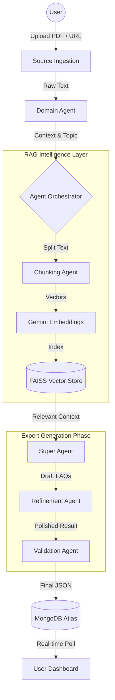
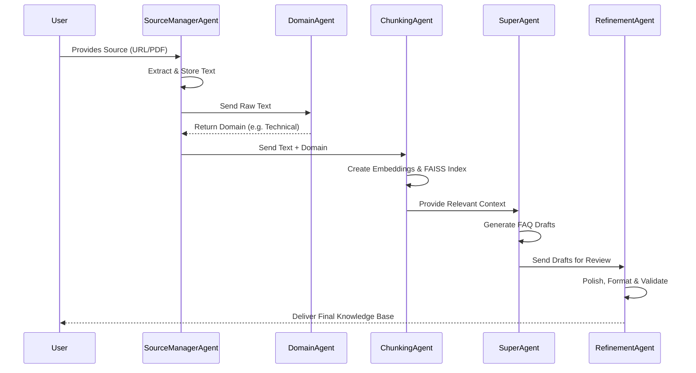

# 🏛️ AquilaFAQ System Architecture

This document explains the internal logic and data flow of the AquilaFAQ system. The core of the system is a **Multi-Agent Orchestrator** that manages the transition from raw data to verified knowledge.

## 🔄 High-Level Data Flow

## 🛠️ The 5-Phase Generation Process

### Phase 1: Ingestion & Domain Mapping
When a source is provided, the **SourceManagerAgent** orchestrates the initial extraction. It delegates to the **DocumentAgent** (for PDFs) or the **WebAgent** (for URLs). Simultaneously, the **DomainAgent** analyzes the content to detect its "Expertise Domain" (e.g., Medical, Technical, Legal).

## 🤖 Deep Dive: The Agent Workforce

AquilaFAQ is powered by a team of specialized AI agents. Each agent has a specific "job description" and criteria for success.

### 1. Source & Extraction Agents
- **SourceManagerAgent**: The lead coordinator for data entry. It manages the retention policy (TTL) and ensures the data is saved securely in MongoDB before processing begins.
- **DocumentAgent**: A precision extractor for PDFs. It handles page-by-page parsing and cleans up OCR noise.
- **WebAgent**: A specialized scraper that filters out "junk" (ads, nav bars, footers) to find the core content of any website.

### 2. The Intelligence Layer
- **DomainAgent**: The "Strategist." It identifies the target audience and tone. If the document is about "Diabetes," it sets the domain to *Medical* so the FAQs aren't too casual.
- **ChunkingAgent**: The "Librarian." It uses the **Gemini Embedding API** to transform raw text into a searchable vector map. It ensures no information is lost by using overlapping chunks.

### 3. The Generation Squad
- **SuperAgent**: The "Expert Author." Armed with the most relevant text chunks, it writes the first draft of the FAQs. It is instructed to be accurate, helpful, and concise.
- **RefinementAgent**: The "Editor-in-Chief." It reviews the SuperAgent's work. It fixes awkward phrasing, ensures professional formatting, and removes repetitive content.
- **ValidatorAgent**: The "Quality Inspector." Its sole job is to ensure the output is perfect JSON and that all questions have corresponding, fact-checked answers.

## 📊 Agent Workflow Chart

### Phase 2: Vectorization (The "Memory" Phase)
The **Chunking Agent** breaks the long text into overlapping blocks. Each block is sent to the **Gemini Embedding API**, which converts human language into a 768-dimensional mathematical vector. These vectors are stored in a local **FAISS Index** for instant semantic retrieval.

### Phase 3: Context Retrieval
Instead of feeding the entire document to the AI (which is expensive and slow), the system performs a **Semantic Search**. It looks for parts of the document that are most relevant to the "Domain" and "Core Topics" identified in Phase 1.

### Phase 4: Expert Synthesis (Super Agent)
The **Super Agent** takes the retrieved context and acts as a subject matter expert. It doesn't just "summarize"; it synthesizes new Questions and Answers that are factually grounded in the source text.

### Phase 5: Editorial Refinement
The **Refinement Agent** acts as the Editor-in-Chief. It checks for:
- **Tone Consistency**: Ensuring a Medical FAQ sounds professional.
- **Clarity**: Removing AI-generated fluff.
- **Formatting**: Ensuring the output is valid JSON for the UI to render.

## 📦 State Management & Persistence

- **Task Manager**: Manages the lifecycle of a generation (Queued -> Processing -> Completed/Failed).
- **MongoDB Atlas**: Stores the final results and user history with a 7-day TTL (Time-To-Live) for automatic cleanup.
- **Background Worker**: All heavy lifting is done in a separate thread to keep the API responsive and prevent timeouts.

---
*AquilaFAQ: Transforming information into intelligence.*
